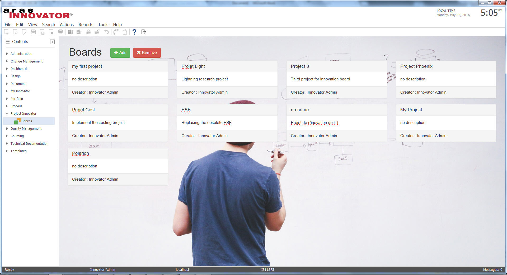
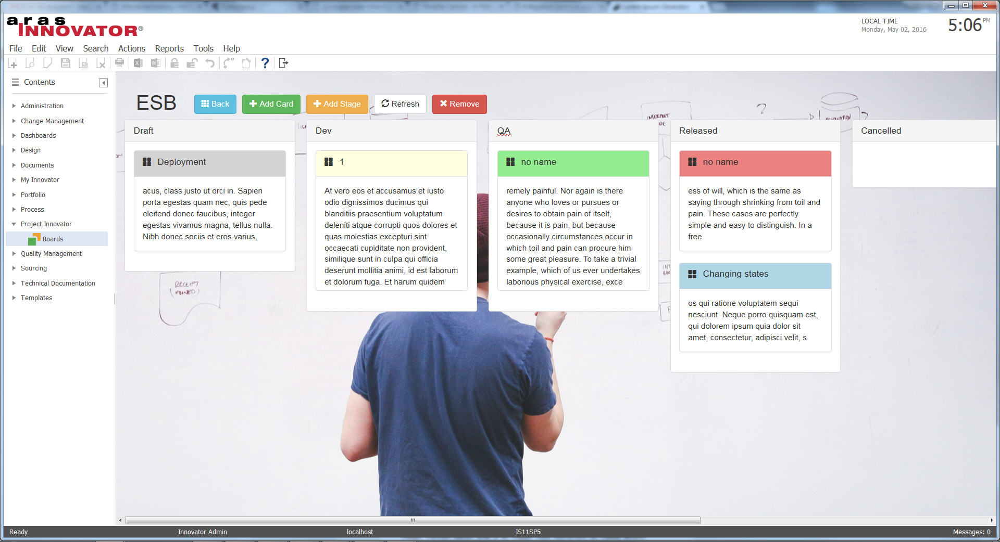

# Kanban-like-task-management
Adds a user interface to manage tasks and sort them by Stage, Account, Risk ...
#### How it works
The Kanban-like-task-management project has two interfaces - the Board listing, and the Board details (when you enter a board by double-clicking on it).

## Project Details

**Built Using:** Aras 11.0 SP7

**Browsers Tested:** Internet Explorer 11, Firefox 38 ESR, Chrome

> Though built and tested using Aras 11.0 SP7, this project should function in older releases of Aras 11.0 and Aras 10.0.

## Installation

#### Important!
**Always back up your code tree and database before applying an import package or code tree patch!**

### Pre-requisites

1. Aras Innovator installed (version 11.0 SPx preferred)
2. Aras Package Import tool

### Install Steps

1. Backup your database and store the BAK file in a safe place.
2. Open up the Aras Package Import tool.
3. Enter your login credentials and click **Login**.
    * _Note: You must log in as root for the package import to succeed!_
4. Enter the package name in the TargetRelease field.
    * Optional: Enter a description in the Description field.
5. Enter the path to your local `..\kanban-like-task-management\Import\imports.mf` file in the Manifest File field.
6. Select **aras.labs.kanbanliketaskmanagement** in the Available for Import field.
7. Select Type = **Merge** and Mode = **Thorough Mode**.
8. Click **Import** in the top-left corner.
9. Close the Aras Package Import tool.
10. Copy `..\kanban-like-task-management\Innovator` in your install folder.
    * _Note: By default C:/Program Files/Aras/Innovator/

You are now ready to log in to Aras and try out Kanban-like task management.

## Usage

1. Log in to Aras as admin.
2. Navigate to **Project Innovator/Boards** in the table of contents (TOC).
3. Click the **add board** button.
4. Edit the board name.
5. Double-click on the created board to open it.
6. Add stages and cards.
7. Cards can be opened by double-clicking and they can be drag and dropped from one stage to another.

## Contributing

1. Fork it!
2. Create your feature branch: `git checkout -b my-new-feature`
3. Commit your changes: `git commit -am 'Add some feature'`
4. Push to the branch: `git push origin my-new-feature`
5. Submit a pull request

For more information on contributing to this project, another Aras Labs project, or any Aras Community project, shoot us an email at araslabs@aras.com.

## Credits

Original Aras community project written by Yoann Maingon at Aras Corp.

Documented and published by Yoann Maingon at Aras Labs. @YoannArasLab

Contributors:

* @sanket0896 

## License

Aras Labs projects are published to Github under the MIT license. See the [LICENSE file](./LICENSE.md) for license rights and limitations.
